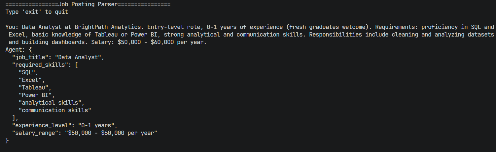

# Job Posting Parser

A simple AI agent that reads a job posting (plain text) and extracts structured information from it — job title, required skills, experience level, and salary range — using an LLM with JSON schema validation and an automatic retry loop.

This is a practice project to learn how to use structured outputs with LLMs, validate responses, and build a basic retry mechanism when the model returns bad data.

## Features

- Takes a job description as plain text input
- Extracts structured fields using Groq's `openai/gpt-oss-120b` model
- Uses strict JSON schema (`response_format`) to guide the model's output
- Validates the response manually (JSON validity, required fields, correct types)
- Automatically retries up to 3 times if the response is invalid, feeding the error back to the model
- Simple command-line chat interface

## Tech Stack

- Python
- OpenAI Python SDK (used with Groq's OpenAI-compatible API)
- Groq API (`openai/gpt-oss-120b` model)
- python-dotenv (for API key management)

## How It Works

1. The user enters a job description in the terminal.
2. The app sends it to the LLM along with a JSON schema describing the expected output format.
3. The model's response is validated:
   - Is it valid JSON?
   - Are all required fields present?
   - Are the field types correct (e.g. `required_skills` must be a list of strings)?
4. If validation fails, the error is sent back to the model as a correction request, and it tries again (up to 3 attempts).
5. Once a valid response is received, it's printed in a clean, readable JSON format.

## Setup

### 1. Clone the repository

```bash
git clone <your-repo-url>
cd <your-repo-folder>
```

### 2. Install dependencies

```bash
pip install openai python-dotenv
```

### 3. Add your Groq API key

Create a `.env` file in the project folder:

```
Groq_API_Key=your_api_key_here
```

You can get a free API key from [Groq Console](https://console.groq.com).

### 4. Run the app

```bash
python main.py
```

## Usage

Once the app is running, just paste or type a job description and press enter:

```
================Job Posting Parser================
Type 'exit' to quit

You: Software Engineer at TechCorp. Requires 3+ years of experience with Python, Django, and PostgreSQL. Salary: $80,000 - $100,000 per year.

Agent: {
  "job_title": "Software Engineer",
  "required_skills": ["Python", "Django", "PostgreSQL"],
  "experience_level": "3+ years",
  "salary_range": "$80,000 - $100,000 per year"
}
```

Type `exit` to quit the program.

## Output Example

Below is a screenshot of the app running in the terminal:



## Project Structure

```
.
├── main.py          # Main application code
├── .env             # API key (not committed to GitHub)
└── README.md        # This file
```

## Notes

- This is a learning/practice project, not built for production use.
- The retry loop helps the model self-correct, but it's not bulletproof — extreme edge cases may still fail after 3 attempts.
- Make sure `.env` is added to `.gitignore` so your API key doesn't get pushed to GitHub.
